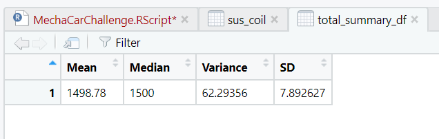

# MechaCar_Statistical_Analysis

# Deliverable 1 
## Purpose:-
-	To perform multiple linear regression and to identify which variables in the dataset predict the mpg of MechaCar prototypes.  

## Materials: 
Dataset: MechaCar_mpg.csv
Software: RStudio and R-programing 
Statistic package: Multiple linear regression 

## Assumptions 
1.	The relationship between X and the mean of Y is linear 
2.	The variance of residual is the same for any value of X. 
3.	The observations are independent of each other. 
4.	For any fixed value of X, Y is normally distributed.

## Hypothesis 
    Null hypothesis:- all variables do not have any impact on MPG.
    Alternate hypothesis:- all or some of the variables have impact on MPG.

## Results 
## Multiple Linear Regression Model to Predict MPG 
    
    p-value = 5.35e-11 which is < 0.05. And at the same time the p-value for Vehicle length and Ground clearance is less than 0.05. 

## Conclusion
   - Based on the results, vehicle length and ground clearance shows statistically (p< 0.5) different or have a significant impact on mpg. 
     Therefore, the two variables can predict MPG. 

### Which variables/coefficients provided a non-random amount of variance to the mpg values in the dataset?
  - According to the analysis, vehicle length and ground clearance have provided a non-random amount of variance to the mpg values in the dataset. Because ehicle length and ground clearance have a significant impact on MGP since their p-values are less than 0.05 (significance level).
  But, Vehicle weight, spoiler angle and AWD have provided a random amount of variance. 
     
### Is the slope of the linear model considered to be zero? Why or why not? 
    - The slope of the linear model is not considered to be zero, because the over all linear model shows that the p-value (5.35e-11) is less than 0.05. This shows there is relationship between x and y axis. Additionally, the R-squared = 0.7149;  i.e
     71.5% of the variability of our mpg variable is explained using this linear model. 

### Does this linear model predict mpg of MechaCar Car protypes effectively? Why or why not? 
  - The R-squared of the model indicated that 71.5% of the variability of our mpg is explained by this model. But for better prediction, 
    further modelling analysis is necessary to access other factors or adding data in maximizing the R-squared value. 
  
# Deliverable 2

## Purpose 
  - To get the summary statistics of Suspension Coils. 

## Results 
 
## Summary Statistics on Suspension Coils

### The total summary; mean, median, variance and standard deviation of the suspension coils (PSI) are as follows:-  
    

### Lot summary to group each manufacturing lot by the mean, median, varinace, and standard deviation of the suspension coil's PSI column. 
    

Based on the total summary, the suspension coil for all manufacturing lots is 62 pounds per square inch. 
Hence the current manufacturing data meet design specification. At the individual level, 
Lot 1 and Lot 2 meet the design specification at 0.98 and 7.47 pounds per square inch, respectively. 
Whereas lot 3 (170.3 PSI) exceeding the design specification and fail to meet the specification. 

# Deliverable 3

## T-Test on Suspension Coils 

### Hypothesis 
Null hypothesis: there is no statistical difference between the manufacturing lots mean and population mean of PSI.
Alternate hypothesis: there is a statistical difference between the manufacturing lots mean and population mean of PSI.

The first t-test compares all manufacturing lots against mean PSI of the population and the other three t-tests compare 
each manufacturing lot against mean PSI of the population.
    
    

## Results and conclusion 
According to the first t-test analysis, the p-value (0.06) is greater than the significance level, 
therefore, there is no statistical difference between the manufacturing lots and population mean of PSI. 
However, the t-test analysis for individual lots shows that the p-value for Lot 1 and 2 is greater than significance level, 
whereas the p-value for Lot 3 is less than (0.04) the significance level. Therefore, 
there is statistical difference between the mean of Lot 3 and population mean of PSI. 

# Deliverable 4

## Study Design: MechaCar Vs Competition

Mostly consumers would like to consider cost, city or highway fuel efficiency and horse power to purchase a car. 

### metric to test 
Cost of car is a dependent variable.
To find the variable that mainly affects the cost of a car. 

### Hypothesis 

Null hypothesis: all variables from city or highway fuel efficiency and horse power does not have impact on the cost of car. 
Alternate hypothesis: all or some of the variable have impact on the cost of car. 

### Statistical test 

The best method to test the hypothesis is multiple linear regression model. Because we have 4 variables and the dependent variable, and 
all independent variables have continuous data types. Additionally, this model can easly access the impact of fuel efficient and 
horse power on the cost of car.

### Data  
We need the following data to run the model:- fuel efficiency both from city and highway, horse power and the cost of a car. 
Regarding sample size, as a rule of thumb we need 10 observations per variable, with approximately 50 total observations. 